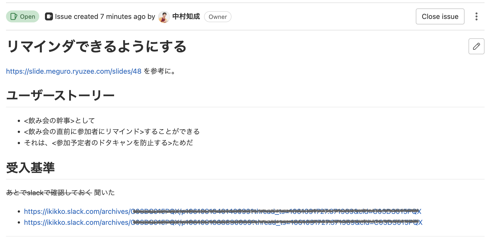
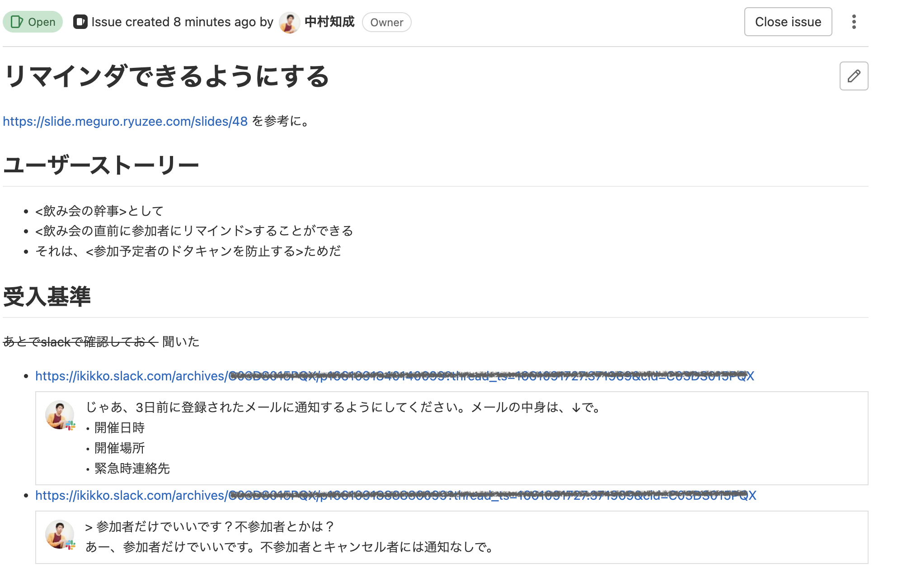
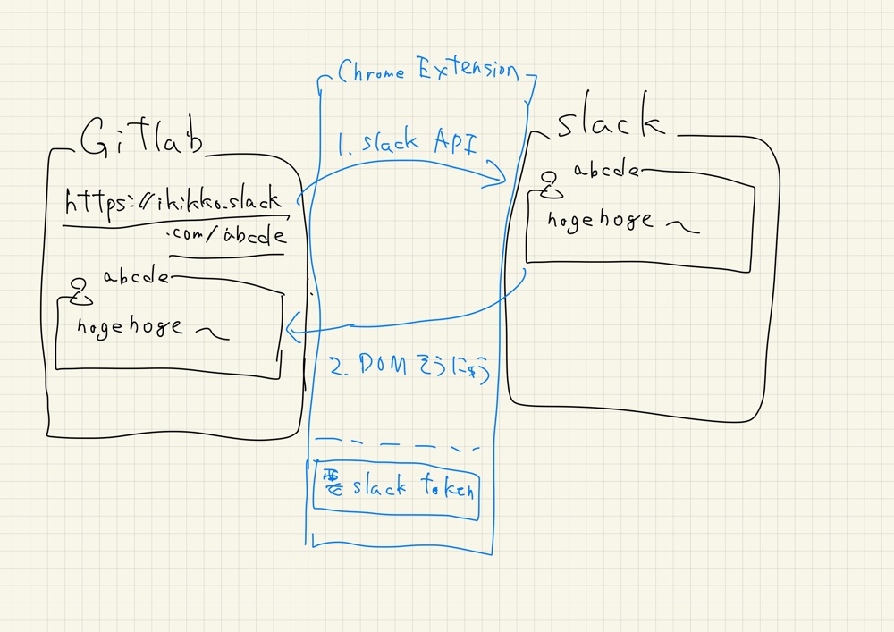

このリポジトリは、Slackのリンクを展開するChrome Extensionです。

# 概要
- 状況：日々のコミュニケーションはSlackでやっているけど、タスク管理やその他の管理は別のサービスを使っている（例えば、GitLabとか）
- 課題：Slackで話したことを、別のサービスに転記するのが面倒。だけど、Slackのリンクだけ貼っても、Slack側に飛ばないと何を書いてるか分からない
- ソリューション：Chrome Extension経由で、Slackのリンクがあったら自動で中身を展開する

## 具体例
Slack上で、下図のようなやり取りをしていたとします。

そのSlack上のやりとりのリンクを他のサービス（GitLab）にはってるけれど、これだけだと何を話しているかがわかりません。

そこで、このChrome Extensionをインストールしておくと、自動でSlackの中身を展開してくれるようになります。

# インストール方法

超雑な概要図です。

## 0. Slack Appの作成
（※：この手順では、各ユーザーごとにSlack Appをインストールする手順になっているが、この手順なくとも使えるようにしたい）

1. [Slack App](https://api.slack.com/apps)で、`Create New App`から新しいAppを作ります
    - `App Name`: 適当な名前（例：Slack Link Preview)
    - `Pick a workspace ...`: 対象のSlackワークスペース
2. `OAuth & Permissions`ページに遷移します
3. `User Token Scopes`にスコープを追加します
    - `reactions:read`
    - `users.profile:read`
4. `OAuth Tokens for Your Workspace`から、`Insatall To Workspace`を実行します
5. `OAuth Tokens for Your Workspace`に生成された`User OAuth Token`を、後ほど使用します

## 1. Chrome Extensionのインストール

1. このリポジトリ(`https://github.com/ikikko/slack-link-preview.git`)を`git clone`します
2. URLに`chrome://extensions`を入力し、Chrome Extension設定ページへ遷移します
3. `デベロッパーモード`を`on`にします
4. `パッケージ化されていない拡張機能を読み込む`をクリックし、cloneしたディレクトリを選択します
5. 一覧に、このExtension`Slack Link Preview`が追加されています
6. `Slack Link Preview`の`詳細`から、`拡張機能のオプション`をクリックします
7. 適切な値を入力し、`save`をクリックします
    - `Workspace`: Slack Appをインストールしたワークスペース
    - `Token`: Slack Appで生成された`User OAuth Token`
8. 上述した具体例のように、SlackのリンクがはられたWebページを開いた際に、自動で中身が展開されるようになります
    - （ただし、現時点で動作確認が取れているのはGitLabだけです）

# 参考
Notionの[Link Preview機能](https://www.notion.so/ja-jp/help/guides/manage-projects-using-link-previews)を参考にしました。スタイルなども参考にしています。

# 残タスク
- [ ] 各自でSlack Appをインストールせずとも使えるようにする
- [ ] Slack Rate Limit 対策 - 1日分ぐらいキャッシュする
- [ ] fetchなど、色々失敗時にログ出す
- [ ] chrome extensionの実行ホストを、登録したホストにのみ制限する
- [ ] 他の有用そうなサービスにも対応
- [ ] スタイルの調整、追加（投稿者や投稿日時、チャンネルの追加など）
- [ ] 開発環境の整備（test, CI, hot reload, ts化など）
